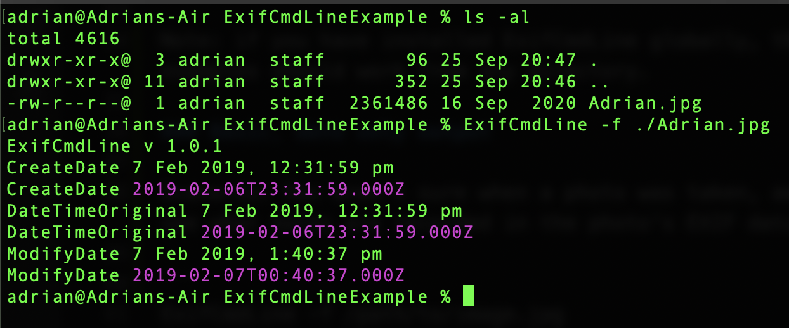
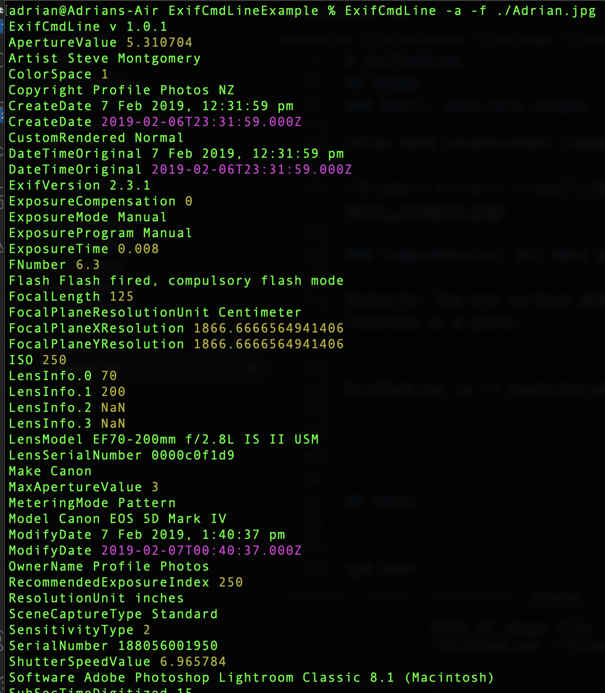
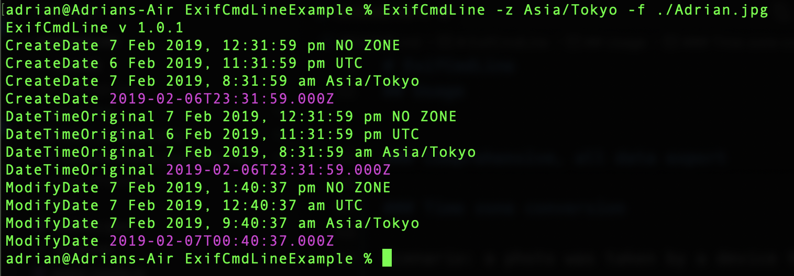

# ExifCmdLine
A simple command line tool for displaying image file EXIF data attributes.

## Project status
Stable, ready for use. 

## Installation
### Local installation

Ensure you have node installed. v20 or better.

Clone the repo to a local directory. 

Change into that directory. 

Use npm to install the application.

```
git clone https://github.com/adrianparker/ExifCmdLine.git
cd ExifCmdLine
npm install
```

### Global installation (recommended)

Follow above instructions for local installation, then  execute

```
npm install -g ././exifcmdline
```

## Usage

Note: if you have installed ExifCmdLine globally, these examples should work from any directory.

### Basic, date only output

Scenario: You aren't sure when a photo was taken, and want to see what dates are recorded in the photo's EXIF data.

```
ExifCmdLine -f /path/to/image.jpg
```
In this example, I have an image and the file system tells me it has a date of 16 September 2020. I thought it was earlier that that though, and sure enough - ExifCmdLine shows it has date attributes of 7 Feb 2019! 

(Also note inconsistent times in that EXIF data, we'll come back to that in a second)



### Comprehensive, all data export

Scenario: You are curious about all the data recorded in a photo.

```
ExifCmdLine -a -f /path/to/image.jpg
```



Same photo, far more comprehensive EXIF data.

We can see Lens data, and Camera Make and Model, and... whatever the camera or post-capture software appended.

Recall the inconsistent modified date in the Basic usage above? Here we see a Software tag for Adobe Lightroom - and so we can surmise the photo was taken at 12:31pm, then touched up in Lightroom an hour or so later. Nice!

Remember: EXIF data varies. Different photos will have different sets of attributes included; and some photos have no EXIF at all - particualrly if they've been through a social media, email or messaging app (they can strip EXIF for privacy reasons)

### Time zone conversion

Scenario: a photo was taken by a device that had the wrong timezone set.

```
ExifCmdLine -z Asia/Tokyo -f /path/to/image.jpg
```

Pass the relevant ['tz'](https://en.wikipedia.org/wiki/List_of_tz_database_time_zones) timezone code to the -z command line argument.



This will display each date attribute unconverted (NO ZONE), converted to UTC, and converted to the timezone you specified.

Exercise caution with this one, devices can automatically infer timezone from GPS or Wi-Fi or myriad other sources.

### Display application version currently installed
```
ExifCmdLine -v
```
### Display brief help re vallid arguments
```
ExifCmdLine -h
```

## Tests

```
npm test
```

## Contributing
Fire in a pull request by all means. Please adhere to Javascript Standard Style: https://standardjs.com/rules.html
